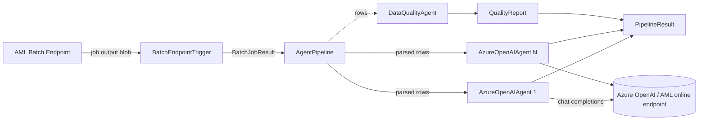

# Architecture

The SDK turns the output of an Azure ML Batch Endpoint job into agent input.

## Flow

1. **`BatchEndpointTrigger`** invokes the batch endpoint, polls until a terminal state, and
   returns a `BatchJobResult` (job name, status, output path). Failures and timeouts raise
   `BatchJobFailedError` / `BatchJobTimeoutError`.
2. **`AgentPipeline`** parses the output (`parse_batch_output`: JSONL/CSV) into rows and feeds
   each row, as a JSON user message, to each agent in order. `DataQualityAgent`s receive all
   rows at once and yield a `QualityReport`.
3. **`AzureOpenAIAgent`** sends system prompt + message to the AOAI deployment and returns an
   `AgentResponse`.
4. The pipeline returns a `PipelineResult` with the job, rows, per-agent responses, and quality reports.

## Composable pieces

| Concern | Component |
|---------|-----------|
| Concurrency | `ParallelAgentGroup` runs N agents on the same input via `asyncio` |
| Routing | `AgentRouter` picks an agent per row by rule |
| Conversation state | `AgentMemory` keeps a token-bounded history |
| Resilience | `RetryPolicy`: exponential backoff + jitter for 429s/transient errors |
| Observability | `PipelineEvents` hooks, structured JSON logs, optional Azure Monitor sink |
| Configuration | Pydantic models, YAML loader, `azureml-agent` CLI |
| Credentials | `CredentialManager`: `DefaultAzureCredential` + env vars, secrets never logged |
| HTTP | Optional FastAPI app (`azureml_agent_sdk.api`) with background runner, run store, bearer auth |

## Testability

All network edges are injectable: `AzureOpenAIAgent(client_factory=...)`,
`BatchEndpointTrigger(aml_client=..., sleep=..., clock=...)`, `RetryPolicy(sleep=...)`. The test
suite and the `examples/` pipelines use these seams, so nothing needs live Azure access.
